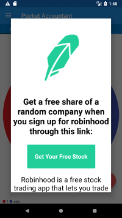

# Custom-Ad



Some people write free android applications out of the goodness of their heart,  to make the world a better place, or just to write software people enjoy. Since most free apps accomplish none of those we can safely assume most people just want to make some money, which is ever harder and harder to accomplish these days. 

This guide is going to show you how to show custom ads that should make you more money then admob.The main features of this package are:
*Show a webpage at a URL you can update at any time
*Only show a user an ad once a day


# Step 0: Find a business model
Generally you will want to utilize referral programs as these do pay rather well for user acquisition. In this example we will use my robinhood referral. When a user signs up for this free stock trading app they'll recieve a random share of a company worth $3-$200, and so will the person referring them. Lets compare that with Google's admob:

  * Admob: pays you only when a user clicks on an add. You could show 3,000 ads in a day and only make a cent. Admob has a $100 withdraw threshold so if you make $98 in ad revenue (very hard to do) you still can't use any of that money

  * A Custom ad: You control the UX, and the finances. If you make $2 you can start using that money long before admob pays out


# Step 1: Create a simple webpage
For this step I created a simple page: [freestock4you.github.io](https://freestock4you.github.io). If you don't have a webserver [github will host a static website for free](https://pages.github.com/).

# Step 2: Add Code to your homepage
In your onCreate add:
 ```java
 //start a new thread
 Runnable runnable = new Runnable() {
            @Override
            public void run() {
                loadCustomAd();
            }
        };
        runnable.run();
```
For an Activty add:
```java
public void loadCustomAd() {

        FragmentManager fragmentManager = getSupportFragmentManager();

        CustomAd ad = new CustomAd();
        ad.setStyle(ad.STYLE_NORMAL, R.style.CustomDialog);

        ad.show(fragmentManager, "Input Dialog");
        if (ad.getDialog() != null){
            ad.getDialog().setCanceledOnTouchOutside(true);
        }


    }
```
For a fragment add:
```java
public void loadCustomAd() {
        android.support.v4.app.FragmentManager fragmentManager = getFragmentManager();
        CustomAd ad = new CustomAd();
        ad.setStyle(ad.STYLE_NORMAL, R.style.CustomDialog);

        ad.show(fragmentManager, "Input Dialog");
        if (ad.getDialog() != null){
            ad.getDialog().setCanceledOnTouchOutside(true);
        }


    }
```

Then just update the URL variable at the top of CustomAd.java

